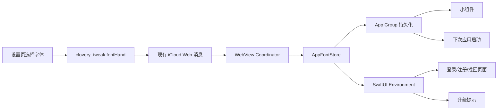

# Clovery 全局字体同步设计

日期：2026-07-19  
状态：已确认方案 A，待实施

## 目标

用户在 Clovery 设置中选择字体后，整个 iOS 应用使用同一字体选择，包括：

- Web 日记主界面与设置页；
- SwiftUI 登录、注册、找回账户和恢复码页面；
- 旧用户升级提示；
- iOS 小组件；
- 退出登录后的登录页面；
- 应用重新启动后的所有原生页面。

首次安装默认使用当前手写体。字体选择保存在设备本地，退出登录不清除；本阶段不增加后端账户字段，也不做跨设备字体同步。

## 当前状态

Web 主界面使用 `clovery_tweak.fontHand` 保存字体，已有以下字体标识：

| 标识 | 设置页名称 |
| --- | --- |
| `Gaegu` | 手写体 |
| `System` | 系统默认 |
| `NotoSerifSC` | 雅宋 |
| `NaiChaTi` | 奶茶体 |

Web 在保存日记和设置变化时，通过现有 `icloud` 消息处理器发送 `widget_font`。Swift 已将该值写入 App Group `group.com.clovery.app`，但登录页面和升级提示仍固定使用 `Gaegu-Regular`。

## 设计原则

1. 字体选择只有一个设备级事实来源。
2. Web 设置变化必须实时更新原生界面。
3. 登录状态不能决定字体；退出登录后仍保留选择。
4. 未知字体标识或字体文件异常不能导致应用退出。
5. 字号、颜色、间距和交互保持不变。
6. 字体能力独立分文件，不向页面文件堆积状态管理逻辑。

## 架构

### 模块划分

新增 `Clovery/Application/Appearance` 模块：

- `AppFontSelection.swift`
  - 定义受支持的字体标识；
  - 处理旧值、未知值和默认值；
  - 提供字体显示名称及原生字体映射。
- `AppFontStore.swift`
  - 负责 App Group 读取和写入；
  - 发布当前字体选择；
  - 处理旧键迁移和运行时更新。
- `CloveryFontModifier.swift`
  - 定义标题、操作、正文、说明四种字体角色；
  - 通过 SwiftUI Environment 读取当前选择；
  - 保持现有动态字体尺寸和无障碍缩放能力。

页面只声明字体角色，例如标题或正文，不直接读取 `UserDefaults`，也不直接判断字体标识。

### 数据流

## 持久化与兼容

App Group 继续使用 `group.com.clovery.app`。

- 新的通用键：`clovery_font_selection`
- 兼容键：`widget_font`

读取顺序：

1. 读取 `clovery_font_selection`；
2. 若不存在，读取现有 `widget_font` 并迁移；
3. 若均不存在或值无效，使用 `Gaegu`。

写入时同时更新两个键：

- `clovery_font_selection` 供整个应用使用；
- `widget_font` 保证现有小组件无需同步升级即可继续工作。

退出登录、清理会话和切换 Clovery 账户时都不删除字体键。卸载应用后恢复默认字体，符合当前设备本地设置语义。

## 原生字体映射

| Web 标识 | 原生主字体 | 字形回退 |
| --- | --- | --- |
| `Gaegu` | `YLHZYS` | `Gaegu-Regular`、`Yomogi-Regular`、系统字体 |
| `System` | iOS 系统字体 | 系统语言默认字体 |
| `NotoSerifSC` | `Noto Serif SC` | 宋体、系统衬线字体 |
| `NaiChaTi` | `BoBoNaiChaTi` | `YLHZYS`、`Gaegu-Regular`、系统字体 |

`Info.plist` 的 `UIAppFonts` 需要注册目前仅由 Web 使用的字体文件：

- `fonts/YueLiangHai-ZiYouShu-2.ttf`
- `fonts/Yomogi-Regular.ttf`
- `fonts/NotoSerifSC-VariableFont_wght.ttf`
- `fonts/NaiChaTi-2.ttf`

若指定字体无法创建，字体构建器自动回退到系统字体。字体加载失败只影响视觉样式，不影响页面启动和账户操作。

## SwiftUI 接入

`ApplicationRootView` 创建并持有一个 `AppFontStore`，将 `selection` 注入 SwiftUI Environment。

原有静态字体：

- `Font.authTitle`
- `Font.authAction`
- `Font.authBody`
- `Font.authCaption`

替换为动态字体角色：

- `.cloveryFont(.title)`
- `.cloveryFont(.action)`
- `.cloveryFont(.body)`
- `.cloveryFont(.caption)`

接入范围：

- `AuthenticationEntryView`
- `LoginView`
- `SignUpView`
- `AccountRecoveryView`
- `RecoveryCodesView`
- 认证公共组件
- `UpgradeNoticeView`

SwiftUI 页面文字保持中文，品牌名称 `Clovery`、`Apple`、`Google`、`Huawei` 保留。

## Web 桥接

不新增后端接口，也不新增第二套 Web 设置。

现有 `icloud` 消息收到 `widget_font` 后：

1. 校验字体标识；
2. 更新 `AppFontStore`；
3. 同时写入通用键和兼容键；
4. 在主线程发布变化；
5. 继续刷新小组件时间线。

Web 仍以 `clovery_tweak.fontHand` 驱动自身字体，Swift 只消费经过桥接的选择，避免双向循环。

## 异常处理

- 未知字体标识：记录为默认 `Gaegu`。
- App Group 不可访问：使用 `UserDefaults.standard` 的内存回退，不阻止启动。
- 字体文件缺失或 PostScript 名称变化：使用系统字体。
- Web 消息缺少 `widget_font`：不修改当前字体。
- 字体切换期间页面正在展示：SwiftUI 原地刷新，不重建账户会话，不刷新 WebView。

## 测试

### 自动化测试

- 字体标识解析及未知值回退；
- App Group 初始读取；
- 从 `widget_font` 迁移到 `clovery_font_selection`；
- 更新时同时写入两个键；
- Web 消息更新字体仓库；
- 四种字体角色保持原有字号和动态类型；
- 缺少字体文件时回退系统字体；
- 登录和升级页面不再引用固定 `Gaegu-Regular`。

### 模拟器验收

依次选择手写体、系统默认、雅宋和奶茶体，并验证：

1. 主界面立即切换；
2. 绑定账户进入登录页后字体一致；
3. 注册、找回账户和恢复码页面字体一致；
4. 旧用户升级提示字体一致；
5. 退出登录后仍使用最后选择；
6. 强制退出并重启应用后仍保持；
7. 未产生新的启动崩溃报告。

## 验收标准

- 用户只需在现有设置页选择一次字体；
- 所有 Web 和 SwiftUI 页面使用同一字体选择；
- 字体切换即时生效；
- 退出登录和应用重启后选择不丢失；
- 不修改账户、日记、订阅和后端数据结构；
- 未知字体或字体资源异常时应用仍可正常运营和上线。

## 非目标

- 跨设备同步字体偏好；
- 后端保存字体偏好；
- 新增字体大小设置；
- 修改现有页面布局、颜色或交互；
- 修改 Android、HarmonyOS 或未来 Flutter 的字体实现。
