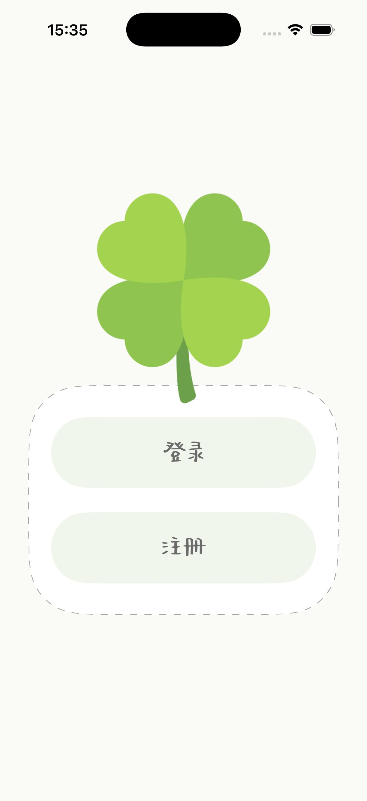

# W9 iOS Account Bootstrap Verification

**Verification date:** 2026-07-27  
**Tested commit:** `76f82b6` (`test(ios): add bootstrap verification fixtures`)  
**Integrated implementation commit:** `7834649` (`feat(ios): complete account inheritance bootstrap`)  
**Simulator:** iPhone 17 Pro, iOS 26.0.1 (`23A8464`), arm64

## Acceptance Result

W9 passes its independent simulator and automated acceptance gate. A clean install remains running and enters the Chinese authentication route. An authenticated account cannot enter the diary until identity, legacy migration, server entitlement reconciliation, and initial Vault pull are complete.

This result does **not** claim App Store release readiness. Physical-device Photos saving, real Apple purchase/restore, background delivery, signing, Archive, and TestFlight remain explicit W10 gates, as previously agreed.

## Automated Gate

### Complete XCTest suite

```bash
CLOVERY_RELEASE_API_BASE_URL=https://api.clovery.cn \
xcodebuild -quiet -project Clovery.xcodeproj -scheme Clovery \
  -destination 'platform=iOS Simulator,name=iPhone 17 Pro,OS=26.0.1' \
  -resultBundlePath /private/tmp/Clovery-W9-commit-76f82b6.xcresult test
```

Result: exit `0`; `202` passed, `0` failed, `0` skipped.

### Release simulator build

```bash
CLOVERY_RELEASE_API_BASE_URL=https://api.clovery.cn \
CLOVERY_RELEASE_SOURCE_COMMIT=76f82b6 \
xcodebuild -quiet -project Clovery.xcodeproj -scheme Clovery \
  -configuration Release -destination 'generic/platform=iOS Simulator' \
  -derivedDataPath /private/tmp/Clovery-W9-Release-76f82b6 \
  build CODE_SIGNING_ALLOWED=NO
```

Result: exit `0`.

Embedded Release configuration:

```text
CloveryAPIBaseURL=https://api.clovery.cn
CloverySourceCommit=76f82b6
FIXTURE_MARKERS=absent
```

`CloveryVerificationFixture` and its debug token are absent from the Release binary. `bash -n scripts/capture-w9-ios-fixtures.sh`, plist validation, and `git diff --check` also pass.

## Clean Install

The simulator was shut down, erased, booted, rebuilt, installed, and launched without fixture arguments. After three seconds, `launchctl` still listed `UIKitApplication:com.clovery.app`; the first route was the Chinese login/register entry rather than the diary.



## Fixture Matrix

The debug-only matrix covers eight routes at default and accessibility XXXL text sizes with all four selectable fonts: Gaegu, System, Noto Serif SC, and NaiChaTi. The source set contains `64` non-empty PNG captures. Only compressed contact sheets are committed to keep repository and workstation storage small.

| Font | Evidence | SHA-256 |
| --- | --- | --- |
| Gaegu | [contact sheet](assets/w9-ios/Gaegu-acceptance.jpg) | `ff88af6f1554b998ee286eb0b7dac5117cfca41ed512b3c1ee9937d4689ede5d` |
| System | [contact sheet](assets/w9-ios/System-acceptance.jpg) | `708092fd62f74c4d59d8ffba26a61de4db906f166f45d34123e4639b00f7df18` |
| Noto Serif SC | [contact sheet](assets/w9-ios/NotoSerifSC-acceptance.jpg) | `c14df6a93e0be4c0093fc51424e841cabc13ca2a2f187ea02e3471a962e65b8b` |
| NaiChaTi | [contact sheet](assets/w9-ios/NaiChaTi-acceptance.jpg) | `44d0983b74c683acf39b2a37a349ffbe8d2828095597b6b3b751d57ab59631dc` |
| Clean install | [authentication](assets/w9-ios/clean-install-authentication.jpg) | `53023c6f1e81882665d9c177b014c56edf081d11ea01e61781efee9e3df78294` |

The matrix routes are:

1. clean authentication entry;
2. mandatory legacy upgrade notice;
3. Apple and Google provider row;
4. Apple identity claim and custom CloveryID creation;
5. migration progress;
6. entitlement progress;
7. needs-attention recovery actions;
8. final account-scoped diary.

The diary fixture uses the real `WebView` with an account/vault namespace. Its notification bridge is disabled only while the debug fixture launch argument is present, preventing simulator permission alerts from contaminating screenshots without changing normal Debug or Release behavior.

## Data Inheritance Evidence

- **Diary gate:** `AccountBootstrapCoordinatorTests.testValidSessionNeverEntersDiaryWhileBootstrapIsPending` and `testConfiguredPipelineMustCompleteBeforeDiaryRoute` prove that pending migration, entitlement, or Vault work cannot route to diary.
- **Restart and checkpoint durability:** `LegacyMigrationCheckpointStoreTests.testAtomicSaveAndCrashRecoveryPreserveProgress`, `LegacyMigrationCoordinatorTests.testInterruptedEntryUploadResumesCheckpointWithoutReExporting`, and `AccountBootstrapCoordinatorTests.testRestartResumesStoredAccountBootstrapJob` cover interruption and restart recovery.
- **Account and Vault isolation:** `AccountVaultRuntimeRegistryTests.testDifferentAccountsUseDifferentLocalBackupAndPhotoNamespaces` and `VaultSyncCheckpointStoreTests.testStateIsDurableAndSeparatedByAccountAndVault` prevent one account from opening another account's local data.
- **Initial pull and cursor safety:** `InitialVaultPullerTests.testPullPaginatesFromDurableCursorAndMaterializesChangesOnce` and `testCursorDoesNotAdvanceWhenAtomicMaterializationFails` ensure no cursor advances before local materialization succeeds.
- **Push, retry, and conflict copy:** `VaultSyncCoordinatorTests` verifies durable operation IDs, ordered push batches, non-repush of unchanged snapshots, and deterministic local conflict copies while preserving the server entry.
- **Photo assets:** `VaultAssetUploaderTests` verifies upload retry identity, verified restore, atomic replacement, unsafe filename rejection, and preservation of an existing file when restore fails.
- **Old CloudKit/KVS is not the new data root:** `WebBridgeContractTests.testAccountVaultModeKeepsLegacyCloudAsReadOnlyRecoveryEvidence` and the `WebViewSyncMode.accountVault` guards prevent authenticated diary push/pull through old CloudKit. Legacy CloudKit and KVS remain collection evidence for migration only.
- **Archives are retained:** successful migration tests reload the verified checkpoint and read the archived manifest from its recorded path. Production migration code contains no success-path deletion of the archive, local Web data, photos, KVS, or CloudKit source.

## Entitlement Evidence

- `AccountEntitlementAPITests` verifies authenticated legacy-claim, transaction verification, restore, and entitlement contracts against the Go API shape.
- `BoardStoreTests.testPurchaseUnlocksAndFinishesOnlyAfterServerConfirmation` proves StoreKit is finished and the paid board is unlocked only after server confirmation.
- `testPendingServerVerificationDoesNotUnlockOrFinish`, `testRefreshUsesServerOutcomeInsteadOfLocalStoreKitUnlock`, and `testTransactionUpdateWaitsForServerBeforeFinishing` prevent local-only entitlement grants.
- `AccountEntitlementCacheTests.testCacheContainsOnlyServerSummaryAndUsesFileProtection` proves the cache excludes signed transaction payloads and source transaction IDs.
- Reconciliation UI exposes only a stable support code. Production transaction IDs are neither displayed nor included in this evidence; numeric IDs in unit tests are synthetic fixtures.

## Modular Boundary Check

Application bootstrap remains split by responsibility rather than accumulated in one file:

| Source | Lines |
| --- | ---: |
| `AccountBootstrapPipeline.swift` | 122 |
| `BootstrapDependencies.swift` | 143 |
| `AccountBootstrapCoordinator.swift` | 242 |
| `BootstrapCheckpointStore.swift` | 47 |
| `ApplicationSessionController.swift` | 87 |
| `ApplicationRootView.swift` | 98 |
| `IOSVerificationFixture.swift` | 163, Debug only |

Legacy readers, archive preparation, checkpointing, API transport, sync runtime, entitlement reconciliation, and presentation remain separate modules under `Features`.

## Deferred W10 Gates

Before Flutter work begins, W10 must still complete on supported physical iPhones:

- save generated images to Photos under denied, limited, add-only, and allowed permission states;
- real Apple purchase, restore, refund/revocation, account mismatch, and App Store Server notification reconciliation;
- upgrade from the currently published App Store build with real local/iCloud data;
- foreground/background synchronization and notification behavior;
- signed Release Archive, privacy manifest, entitlements, TestFlight installation, and App Store Connect validation.

