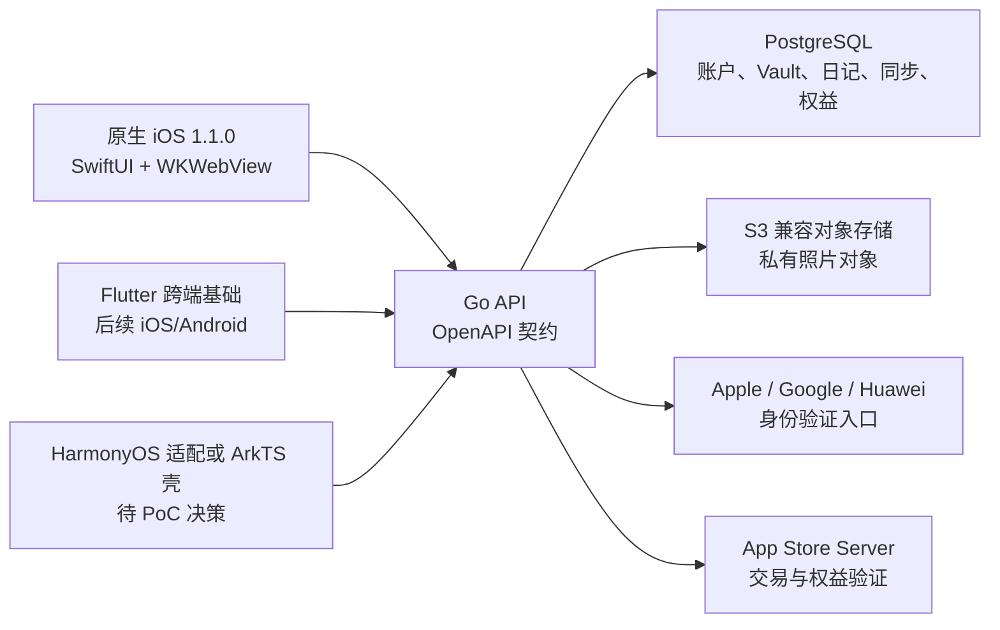

# Clovery 技术与数据架构

## 1. 总体结构



当前 iOS 升级版本仍保留原应用的 SwiftUI 原生壳、WKWebView 离线页面和 WidgetKit，以最低风险完成现有用户升级。Flutter 不替换本次升级版；它是后续多端共用 UI、离线数据库和同步引擎的基础。

## 2. 根账户模型

```text
Clovery Account（clovery_account_id）
├── Clovery ID + 密码
├── Vault（vault_id）
│   ├── 日记与删除墓碑
│   ├── 图片元数据与私有对象
│   ├── 同步游标与冲突记录
│   └── 迁移记录与云端配额
├── 权益与订阅账本
├── Apple Identity（可替换登录方式）
├── Google Identity（可替换登录方式）
├── Huawei Identity（可替换登录方式）
├── Passkey / 恢复码
└── 设备与可撤销会话
```

核心规则：

- `clovery_account_id` 是唯一账户主体，`vault_id` 是用户数据边界。
- 第三方平台只提供身份验证，不拥有日记、图片或购买权益。
- 第三方身份按稳定的 `(provider, issuer, subject)` 绑定，禁止按邮箱自动合并。
- 未绑定的新身份不能猜测并进入已有账户，必须先验证已有 Clovery 账户再绑定。
- 解绑最后一种可用凭证前，必须先添加其他登录方式、Passkey 或恢复凭证。
- Clovery ID 由用户注册时自定义：以字母开头，只允许 4–24 位小写字母、数字和下划线。
- 密码长度为 8–256 个 Unicode 字符，服务端还会拒绝常见弱密码。

## 3. 数据存储

| 数据 | 主要存储 | 说明 |
| --- | --- | --- |
| 账户、身份、设备、会话 | PostgreSQL | 外部身份与根账户分离；refresh token 仅保存哈希 |
| Vault、日记、冲突、同步游标 | PostgreSQL | Vault 隔离、版本号、墓碑、幂等 operation ID |
| 图片内容 | S3 兼容私有对象存储 | PostgreSQL 只保存对象元数据；上传和下载使用短期签名 URL |
| 购买与权益 | PostgreSQL 服务端账本 | 由 App Store Server 数据校验，不以客户端开关为事实源 |
| iOS 会话凭证 | Keychain | 不写 WebView、UserDefaults、日志或 Widget 共享区 |
| 旧版数据 | localStorage、App Group/iCloud、CloudKit | 仅作为升级迁移来源，迁移成功前保留原数据 |

本地开发通过 Docker Compose 启动 PostgreSQL 17 和 MinIO。生产环境必须使用独立数据库、私有对象桶、TLS、备份、监控和 Secret 管理器，不能复用示例凭证。

## 4. 旧用户升级与数据继承

旧用户流程固定为：

1. 旧版本升级后在原加载页显示中文更新公告；
2. 用户确认后进入登录或注册；
3. 已使用 Apple 登录的用户先验证该身份，再将其绑定为 Clovery 账户的一种登录方式；
4. 客户端读取旧 localStorage、iCloud/CloudKit 和购买状态，生成可校验迁移清单；
5. 服务端将数据复制到同一 `vault_id`，校验数量、字节数和 SHA-256；
6. 权益服务按已验证交易恢复至同一 `clovery_account_id`；
7. 只有服务端确认迁移完成后才进入正常首页，原始数据不会在迁移前删除。

新安装用户没有旧数据认领阶段，加载后直接进入登录/注册，完成后进入空 Vault 首页。

## 5. 同步协议

- 客户端先写本地，再以唯一 `operation_id` 上传，重试不会重复创建记录。
- 服务端为 Vault 变更分配连续游标，客户端分页拉取并保存最后成功游标。
- 删除以墓碑传播，避免另一设备将已删除日记重新写回。
- 旧 `base_revision` 的编辑返回冲突快照，不静默覆盖。
- 设备仅缓存可撤销凭证和 Vault 副本，移除设备不会删除云端账户数据。

## 6. 购买与权益

- iOS 商品固定为 `com.clovery.app.board.lifetime`，最终状态仍需在 App Store Connect 核对。
- 客户端 StoreKit 结果必须提交后端验证，UI 只观察后端权益快照。
- 购买、恢复、撤销和退款均按根账户入账，不能按 Apple ID、设备或本地布尔值解锁。
- 已付费旧用户必须通过原始交易和账户认领流程继承权益；异常用户需要运营补偿流程，不能要求重复购买。

## 7. 跨端边界

- Flutter 复用 UI、领域模型、Drift 本地库和同步状态机。
- iOS 原生层只承接 Keychain、Passkey、照片、StoreKit、Widget 等系统能力。
- Android 原生层使用 Kotlin 承接 Credential Manager、Google 登录、Play Billing、WorkManager 和 Widget。
- HarmonyOS 先做真机 PoC；无论使用 Flutter 适配还是 ArkTS 壳，均复用同一 Go API、OpenAPI、Clovery 账户和 Vault。
- 禁止各平台各自创建账户、支付或同步事实源。
